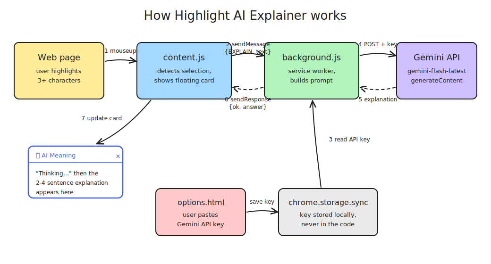

# Highlight AI Explainer

Highlight text on any web page → a floating card shows an instant AI explanation, powered by the Gemini API.

## How it works

1. You select 3+ characters on any page — `content.js` catches the `mouseup` event
2. It shows a floating "AI Meaning" card ("Thinking…") and sends the text to the service worker via `chrome.runtime.sendMessage({ type: "EXPLAIN", text })`
3. `background.js` reads your Gemini API key from `chrome.storage.sync` (saved once via the Options page)
4. It POSTs the text with a concise-explainer system prompt to the Gemini API (`gemini-flash-latest`)
5. Gemini returns a 2–4 sentence explanation
6. The service worker sends the answer back via `sendResponse`
7. The card swaps "Thinking…" for the explanation

The diagram source is editable at [excalidraw.com](https://excalidraw.com) — open `how-it-works.excalidraw`.

## Install

1. Download / clone this repo
2. Open `chrome://extensions`
3. Enable **Developer mode** (top right)
4. Click **Load unpacked** → select the extension folder

## Setup (API key)

1. Get a free Gemini API key at [aistudio.google.com/apikey](https://aistudio.google.com/apikey)
2. Right-click the extension icon → **Options**
3. Paste the key → **Save**

The key is stored only in your Chrome sync storage — never in the code.

## Use

- Select 3+ characters of text → an "AI Meaning" card appears below the selection
- `Esc` or × closes it; clicking elsewhere clears it

## Files

- `manifest.json` — MV3 config
- `content.js` — selection detection + floating card UI
- `background.js` — Gemini API calls (`gemini-flash-latest`)
- `options.html` / `options.js` — API key settings page
- `popup.css` — card styling
